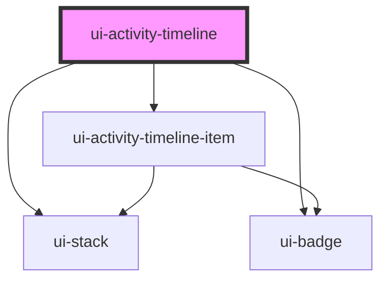

# ui-activity-timeline

<!-- Auto Generated Below -->

## Properties

| Property | Attribute | Description | Type                            | Default               |
| -------- | --------- | ----------- | ------------------------------- | --------------------- |
| `events` | --        |             | `ActivityTimelineEventRecord[]` | `[]`                  |
| `label`  | `label`   |             | `string`                        | `'Activity timeline'` |

## Dependencies

### Depends on

- [ui-stack](../../../layout/ui-stack)
- [ui-badge](../../../feedback/ui-badge)
- [ui-activity-timeline-item](../ui-activity-timeline-item)

### Graph

----------------------------------------------

*Built with [StencilJS](https://stenciljs.com/)*
