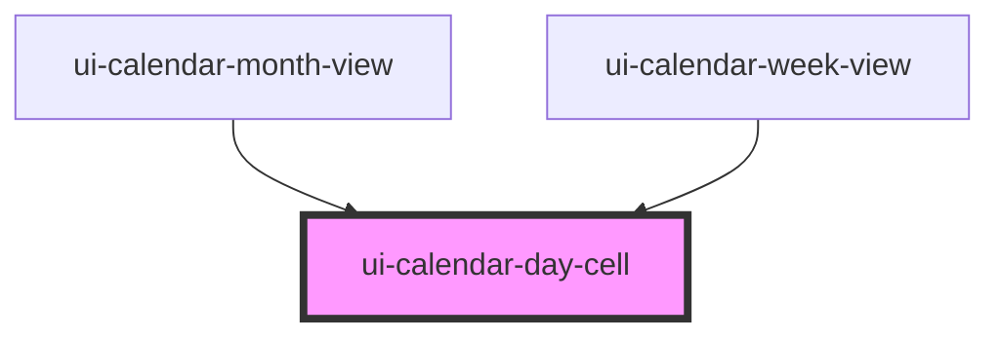

# ui-calendar-day-cell

<!-- Auto Generated Below -->

## Properties

| Property       | Attribute       | Description | Type      | Default |
| -------------- | --------------- | ----------- | --------- | ------- |
| `date`         | `date`          |             | `string`  | `''`    |
| `dayNumber`    | `day-number`    |             | `number`  | `0`     |
| `label`        | `label`         |             | `string`  | `''`    |
| `outsideMonth` | `outside-month` |             | `boolean` | `false` |
| `selected`     | `selected`      |             | `boolean` | `false` |
| `today`        | `today`         |             | `boolean` | `false` |

## Events

| Event                  | Description | Type                             |
| ---------------------- | ----------- | -------------------------------- |
| `uiCalendarDateSelect` |             | `CustomEvent<{ date: string; }>` |

## Dependencies

### Used by

 - [ui-calendar-month-view](../ui-calendar-month-view)
 - [ui-calendar-week-view](../ui-calendar-week-view)

### Graph

----------------------------------------------

*Built with [StencilJS](https://stenciljs.com/)*
