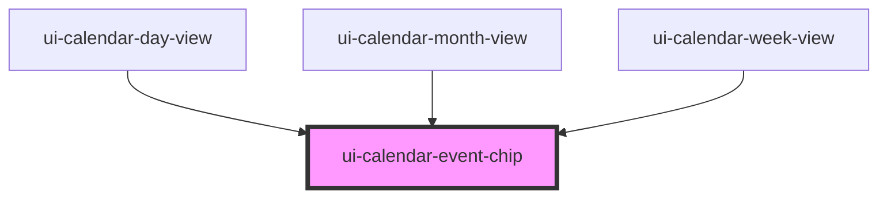

# ui-calendar-event-chip

<!-- Auto Generated Below -->

## Properties

| Property             | Attribute | Description | Type                    | Default     |
| -------------------- | --------- | ----------- | ----------------------- | ----------- |
| `date`               | `date`    |             | `string`                | `''`        |
| `event` _(required)_ | --        |             | `CalendarEventRecord`   | `undefined` |
| `tone`               | `tone`    |             | `"accent" \| "neutral"` | `'neutral'` |

## Events

| Event                     | Description | Type                                                         |
| ------------------------- | ----------- | ------------------------------------------------------------ |
| `uiCalendarEventActivate` |             | `CustomEvent<{ event: CalendarEventRecord; date: string; }>` |

## Dependencies

### Used by

 - [ui-calendar-day-view](../ui-calendar-day-view)
 - [ui-calendar-month-view](../ui-calendar-month-view)
 - [ui-calendar-week-view](../ui-calendar-week-view)

### Graph

----------------------------------------------

*Built with [StencilJS](https://stenciljs.com/)*
