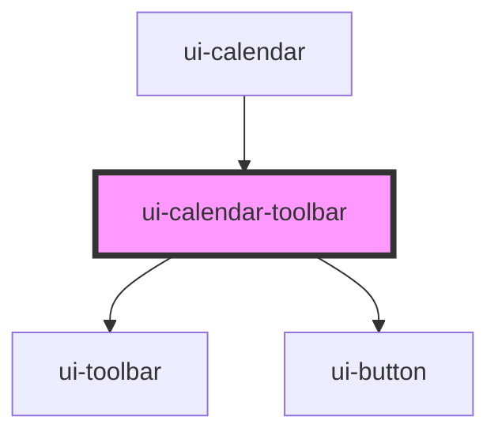

# ui-calendar-toolbar

<!-- Auto Generated Below -->

## Properties

| Property     | Attribute     | Description | Type     | Default |
| ------------ | ------------- | ----------- | -------- | ------- |
| `rangeLabel` | `range-label` |             | `string` | `''`    |

## Events

| Event                | Description | Type                                                  |
| -------------------- | ----------- | ----------------------------------------------------- |
| `uiCalendarNavigate` |             | `CustomEvent<{ direction: CalendarNavigateAction; }>` |

## Dependencies

### Used by

 - [ui-calendar](../ui-calendar)

### Depends on

- [ui-toolbar](../../../compositions/ui-toolbar)
- [ui-button](../../../primitives/ui-button)

### Graph

----------------------------------------------

*Built with [StencilJS](https://stenciljs.com/)*
