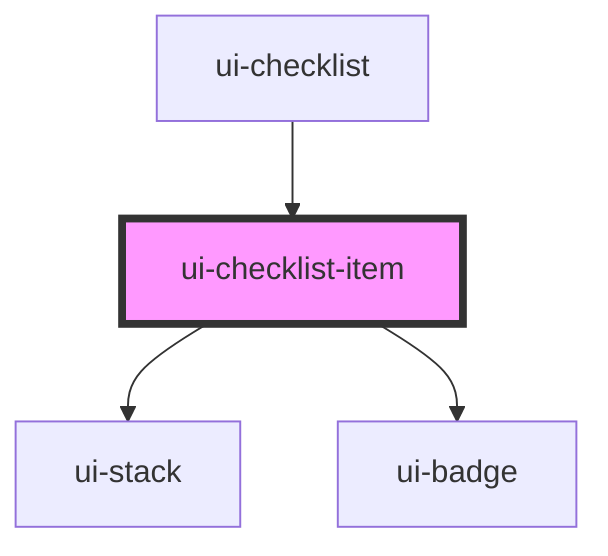

# ui-checklist-item

<!-- Auto Generated Below -->

## Properties

| Property            | Attribute   | Description | Type                    | Default     |
| ------------------- | ----------- | ----------- | ----------------------- | ----------- |
| `completed`         | `completed` |             | `boolean`               | `false`     |
| `item` _(required)_ | --          |             | `ChecklistItemRecord`   | `undefined` |
| `tone`              | `tone`      |             | `"accent" \| "neutral"` | `'neutral'` |

## Events

| Event                   | Description | Type                                                                  |
| ----------------------- | ----------- | --------------------------------------------------------------------- |
| `uiChecklistItemToggle` |             | `CustomEvent<{ item: ChecklistItemRecord; nextCompleted: boolean; }>` |

## Dependencies

### Used by

 - [ui-checklist](../ui-checklist)

### Depends on

- [ui-stack](../../../layout/ui-stack)
- [ui-badge](../../../feedback/ui-badge)

### Graph

----------------------------------------------

*Built with [StencilJS](https://stenciljs.com/)*
