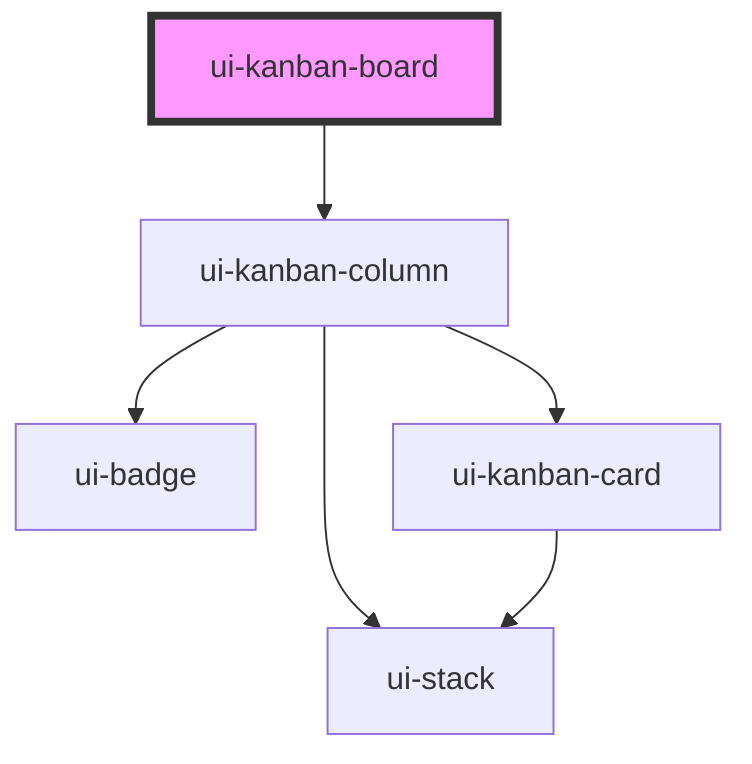

# ui-kanban-board

<!-- Auto Generated Below -->

## Properties

| Property  | Attribute | Description | Type                   | Default |
| --------- | --------- | ----------- | ---------------------- | ------- |
| `columns` | --        |             | `KanbanColumnRecord[]` | `[]`    |

## Dependencies

### Depends on

- [ui-kanban-column](../ui-kanban-column)

### Graph

----------------------------------------------

*Built with [StencilJS](https://stenciljs.com/)*
