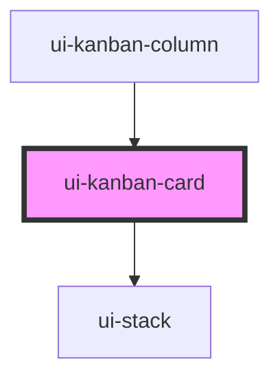

# ui-kanban-card

<!-- Auto Generated Below -->

## Properties

| Property            | Attribute   | Description | Type                    | Default     |
| ------------------- | ----------- | ----------- | ----------------------- | ----------- |
| `card` _(required)_ | --          |             | `KanbanCardRecord`      | `undefined` |
| `columnId`          | `column-id` |             | `string`                | `''`        |
| `tone`              | `tone`      |             | `"accent" \| "neutral"` | `'neutral'` |

## Events

| Event                  | Description | Type                                                         |
| ---------------------- | ----------- | ------------------------------------------------------------ |
| `uiKanbanCardActivate` |             | `CustomEvent<{ columnId: string; card: KanbanCardRecord; }>` |

## Dependencies

### Used by

 - [ui-kanban-column](../ui-kanban-column)

### Depends on

- [ui-stack](../../../layout/ui-stack)

### Graph

----------------------------------------------

*Built with [StencilJS](https://stenciljs.com/)*
