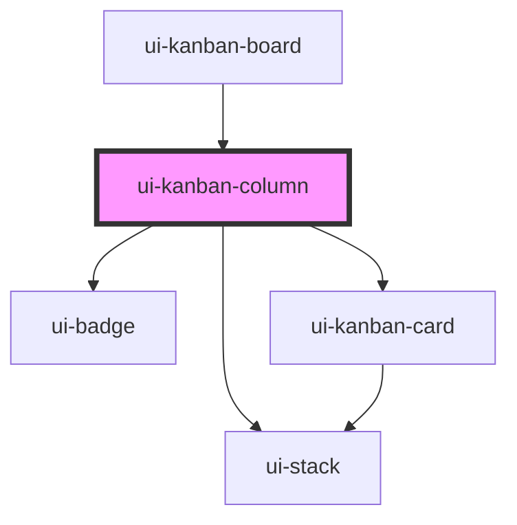

# ui-kanban-column

<!-- Auto Generated Below -->

## Properties

| Property      | Attribute      | Description | Type                 | Default |
| ------------- | -------------- | ----------- | -------------------- | ------- |
| `cardCount`   | `card-count`   |             | `number`             | `0`     |
| `cards`       | --             |             | `KanbanCardRecord[]` | `[]`    |
| `columnId`    | `column-id`    |             | `string`             | `''`    |
| `columnTitle` | `column-title` |             | `string`             | `''`    |

## Dependencies

### Used by

 - [ui-kanban-board](../ui-kanban-board)

### Depends on

- [ui-stack](../../../layout/ui-stack)
- [ui-badge](../../../feedback/ui-badge)
- [ui-kanban-card](../ui-kanban-card)

### Graph

----------------------------------------------

*Built with [StencilJS](https://stenciljs.com/)*
