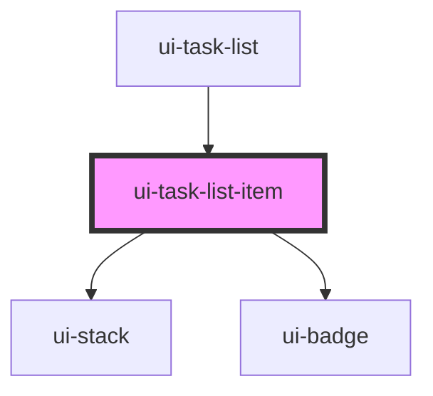

# ui-task-list-item

<!-- Auto Generated Below -->

## Properties

| Property            | Attribute | Description | Type                    | Default     |
| ------------------- | --------- | ----------- | ----------------------- | ----------- |
| `item` _(required)_ | --        |             | `TaskListItemRecord`    | `undefined` |
| `tone`              | `tone`    |             | `"accent" \| "neutral"` | `'neutral'` |

## Events

| Event                    | Description | Type                                         |
| ------------------------ | ----------- | -------------------------------------------- |
| `uiTaskListItemActivate` |             | `CustomEvent<{ item: TaskListItemRecord; }>` |

## Dependencies

### Used by

 - [ui-task-list](../ui-task-list)

### Depends on

- [ui-stack](../../../layout/ui-stack)
- [ui-badge](../../../feedback/ui-badge)

### Graph

----------------------------------------------

*Built with [StencilJS](https://stenciljs.com/)*
