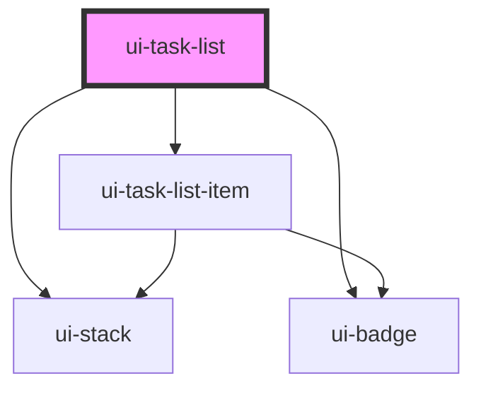

# ui-task-list

<!-- Auto Generated Below -->

## Properties

| Property | Attribute | Description | Type                   | Default       |
| -------- | --------- | ----------- | ---------------------- | ------------- |
| `items`  | --        |             | `TaskListItemRecord[]` | `[]`          |
| `label`  | `label`   |             | `string`               | `'Task list'` |

## Dependencies

### Depends on

- [ui-stack](../../../layout/ui-stack)
- [ui-badge](../../../feedback/ui-badge)
- [ui-task-list-item](../ui-task-list-item)

### Graph

----------------------------------------------

*Built with [StencilJS](https://stenciljs.com/)*
