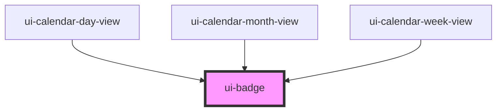

# ui-badge

<!-- Auto Generated Below -->

## Properties

| Property | Attribute | Description | Type                    | Default     |
| -------- | --------- | ----------- | ----------------------- | ----------- |
| `tone`   | `tone`    |             | `"accent" \| "neutral"` | `'neutral'` |

## Dependencies

### Used by

 - [ui-calendar-day-view](../../business-widgets/calendar/ui-calendar-day-view)
 - [ui-calendar-month-view](../../business-widgets/calendar/ui-calendar-month-view)
 - [ui-calendar-week-view](../../business-widgets/calendar/ui-calendar-week-view)

### Graph

----------------------------------------------

*Built with [StencilJS](https://stenciljs.com/)*
