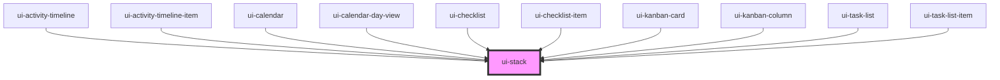

# ui-stack

<!-- Auto Generated Below -->

## Properties

| Property | Attribute | Description | Type                   | Default |
| -------- | --------- | ----------- | ---------------------- | ------- |
| `space`  | `space`   |             | `"lg" \| "md" \| "sm"` | `'md'`  |

## Dependencies

### Used by

 - [ui-activity-timeline](../../business-widgets/activity-timeline/ui-activity-timeline)
 - [ui-activity-timeline-item](../../business-widgets/activity-timeline/ui-activity-timeline-item)
 - [ui-calendar](../../business-widgets/calendar/ui-calendar)
 - [ui-calendar-day-view](../../business-widgets/calendar/ui-calendar-day-view)
 - [ui-checklist](../../business-widgets/checklist/ui-checklist)
 - [ui-checklist-item](../../business-widgets/checklist/ui-checklist-item)
 - [ui-kanban-card](../../business-widgets/kanban/ui-kanban-card)
 - [ui-kanban-column](../../business-widgets/kanban/ui-kanban-column)
 - [ui-task-list](../../business-widgets/task-list/ui-task-list)
 - [ui-task-list-item](../../business-widgets/task-list/ui-task-list-item)

### Graph

----------------------------------------------

*Built with [StencilJS](https://stenciljs.com/)*
