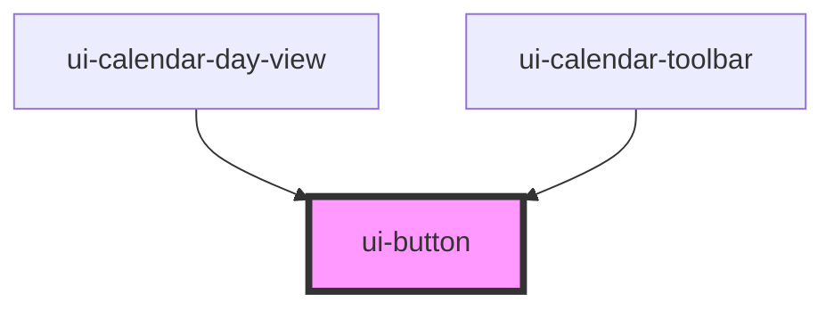

# ui-button

<!-- Auto Generated Below -->

## Properties

| Property   | Attribute  | Description | Type                              | Default       |
| ---------- | ---------- | ----------- | --------------------------------- | ------------- |
| `disabled` | `disabled` |             | `boolean`                         | `false`       |
| `pressed`  | `pressed`  |             | `boolean \| undefined`            | `undefined`   |
| `type`     | `type`     |             | `"button" \| "reset" \| "submit"` | `'button'`    |
| `variant`  | `variant`  |             | `"primary" \| "secondary"`        | `'secondary'` |

## Dependencies

### Used by

 - [ui-calendar-day-view](../../business-widgets/calendar/ui-calendar-day-view)
 - [ui-calendar-toolbar](../../business-widgets/calendar/ui-calendar-toolbar)

### Graph

----------------------------------------------

*Built with [StencilJS](https://stenciljs.com/)*
