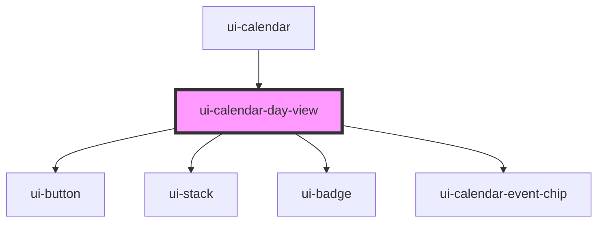

# ui-calendar-day-view

<!-- Auto Generated Below -->

## Properties

| Property       | Attribute       | Description | Type                    | Default                                 |
| -------------- | --------------- | ----------- | ----------------------- | --------------------------------------- |
| `anchorDate`   | `anchor-date`   |             | `string`                | `new Date().toISOString().slice(0, 10)` |
| `events`       | --              |             | `CalendarEventRecord[]` | `[]`                                    |
| `locale`       | `locale`        |             | `string`                | `'en-US'`                               |
| `selectedDate` | `selected-date` |             | `string \| undefined`   | `undefined`                             |

## Events

| Event                  | Description | Type                             |
| ---------------------- | ----------- | -------------------------------- |
| `uiCalendarDateSelect` |             | `CustomEvent<{ date: string; }>` |

## Dependencies

### Used by

 - [ui-calendar](../ui-calendar)

### Depends on

- [ui-button](../ui-button)
- [ui-stack](../ui-stack)
- [ui-badge](../ui-badge)
- [ui-calendar-event-chip](../ui-calendar-event-chip)

### Graph

----------------------------------------------

*Built with [StencilJS](https://stenciljs.com/)*
