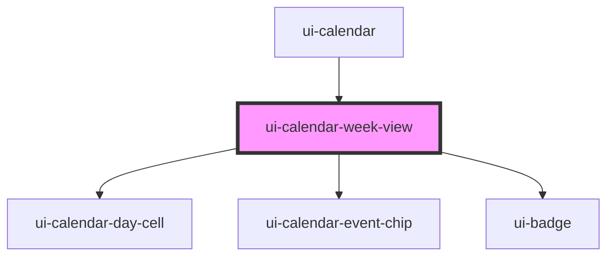

# ui-calendar-week-view

<!-- Auto Generated Below -->

## Properties

| Property         | Attribute           | Description | Type                              | Default                                 |
| ---------------- | ------------------- | ----------- | --------------------------------- | --------------------------------------- |
| `anchorDate`     | `anchor-date`       |             | `string`                          | `new Date().toISOString().slice(0, 10)` |
| `events`         | --                  |             | `CalendarEventRecord[]`           | `[]`                                    |
| `firstDayOfWeek` | `first-day-of-week` |             | `0 \| 1 \| 2 \| 3 \| 4 \| 5 \| 6` | `0`                                     |
| `locale`         | `locale`            |             | `string`                          | `'en-US'`                               |
| `selectedDate`   | `selected-date`     |             | `string \| undefined`             | `undefined`                             |

## Dependencies

### Used by

 - [ui-calendar](../ui-calendar)

### Depends on

- [ui-calendar-day-cell](../ui-calendar-day-cell)
- [ui-calendar-event-chip](../ui-calendar-event-chip)
- [ui-badge](../ui-badge)

### Graph

----------------------------------------------

*Built with [StencilJS](https://stenciljs.com/)*
