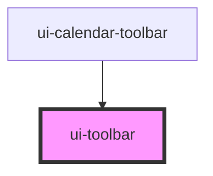

# ui-toolbar

<!-- Auto Generated Below -->

## Properties

| Property  | Attribute | Description | Type                               | Default     |
| --------- | --------- | ----------- | ---------------------------------- | ----------- |
| `justify` | `justify` |             | `"between" \| "center" \| "start"` | `'between'` |

## Dependencies

### Used by

 - [ui-calendar-toolbar](../ui-calendar-toolbar)

### Graph

----------------------------------------------

*Built with [StencilJS](https://stenciljs.com/)*
